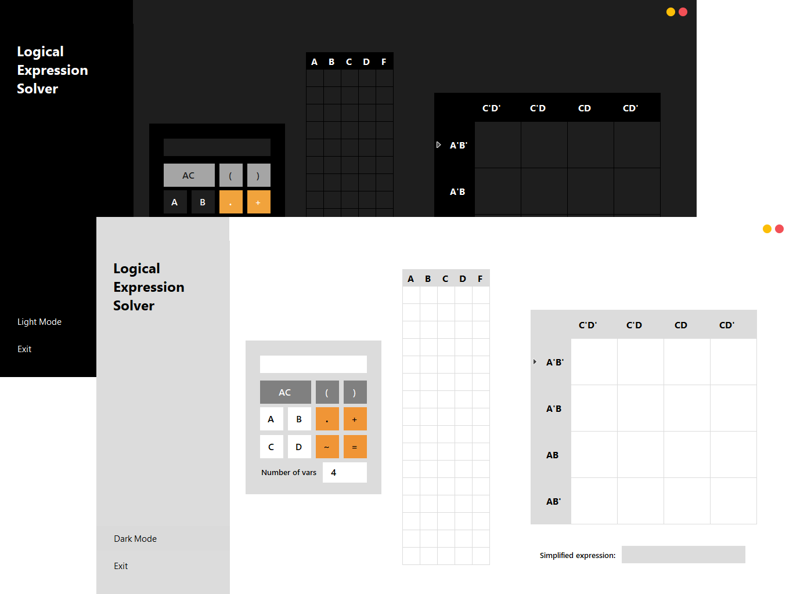
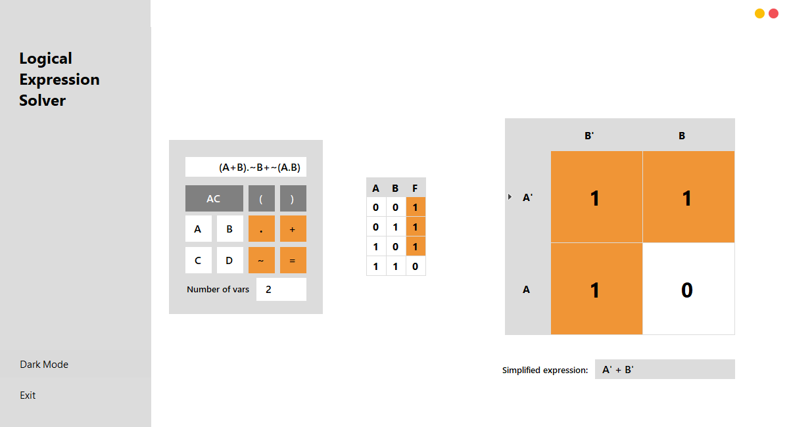
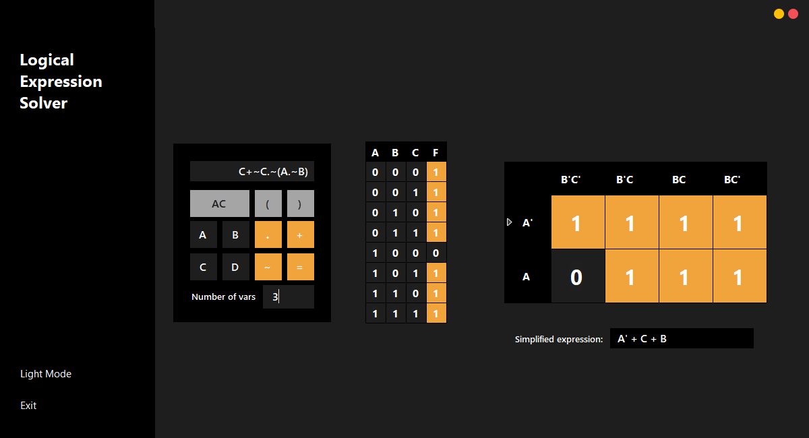
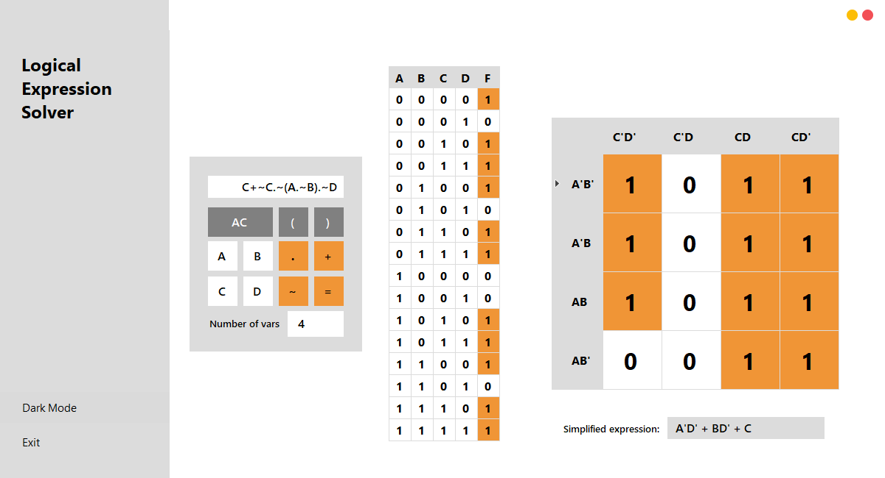

# Logical Expression Solver

## Description

[Logical Expression Solver](https://github.com/maujoooo/logical-expression-solver) is a tool for resolve logical expressions using karnaugh map method. The program has support for 2, 3, 4 variables.

## Installation
- Use the next [link]((https://github.com/maujoooo/logical-expression-solver/releases/tag/v0.0.1)) for download zip file.
- Unzip the file and use any of the provided installation methods.
- If you get an alert like "Windows protected your PC", click more info and run anyway.
- Enjoy using it 😊 !!!

## Another screenshots

